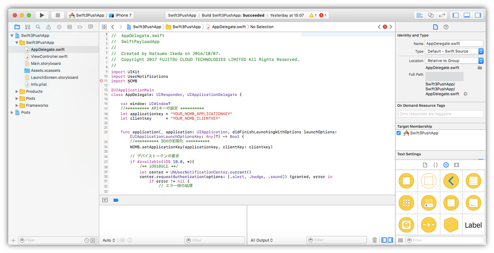

# 【Swift】プッシュ通知からデータを取得してみよう！（ペイロード）
*2016/10/07作成（2020/07/08更新）*


## 概要
* [ニフクラmobile backend](https://mbaas.nifcloud.com/)の『プッシュ通知』機能とプッシュ通知を受信する際、プッシュ通知の『ペイロードデータを取得する』機能を実装したサンプルプロジェクトです
* 簡単な操作ですぐに [ニフクラmobile backend](https://mbaas.nifcloud.com/)の機能を体験いただけます★☆

## ニフクラmobile backendって何？？
スマートフォンアプリのバックエンド機能（プッシュ通知・データストア・会員管理・ファイルストア・SNS連携・位置情報検索・スクリプト）が**開発不要**、しかも基本**無料**(注1)で使えるクラウドサービス！

注1：詳しくは[こちら](https://mbaas.nifcloud.com/price.htm)をご覧ください


## 動作環境
* Mac OS 11.5.2(Big Sur)
* Xcode ver. 13.2.1
* iPhone 11 Pro Max (iOS15.2.1)
  * このサンプルアプリは、プッシュ通知を受信する必要があるため実機ビルドが必要です

※上記内容で動作確認をしています

## プッシュ通知の仕組み
* ニフクラmobile backendのプッシュ通知は、iOSが提供している通知サービスを利用しています
 * iOSの通知サービス　__APNs（Apple Push Notification Service）__

 

* 上図のように、アプリ（Xcode）・サーバー（ニフクラmobile backend）・通知サービス（APNs）の間でやり取りを行うため、認証が必要になります
 * 認証に必要な鍵や証明書の作成は作業手順の「0.プッシュ通知機能使うための準備」で行います

## 作業の手順
### 0.プッシュ通知機能使うための準備
__[【iOS】プッシュ通知の受信に必要な証明書の作り方(開発用)](https://github.com/NIFCLOUD-mbaas/iOS_Certificate)__
* 上記のドキュメントをご覧の上、必要な証明書類の作成をお願いします
 * 証明書の作成には[Apple Developer Program](https://developer.apple.com/account/)の登録（有料）が必要です


### 1. [ニフクラmobile backend](https://mbaas.nifcloud.com/)の会員登録とログイン→アプリ作成と設定
* 上記リンクから会員登録（無料）をします。登録ができたらログインをすると下図のように「アプリの新規作成」画面が出るのでアプリを作成します


* アプリ作成されると下図のような画面になります
* この２種類のAPIキー（アプリケーションキーとクライアントキー）はXcodeで作成するiOSアプリに[ニフクラmobile backend](https://mbaas.nifcloud.com/)を紐付けるために使用します


* 続けてプッシュ通知の設定を行います
* 「アプリ設定」＞「プッシュ通知」を開きます
  * プッシュ通知の許可：「許可する」を選択して「保存する」をクリックします
  * 証明書（p12）：「⑦APNs用証明書(.p12)」をここに設定します


### 2. GitHubからサンプルプロジェクトのダウンロード

* 下記リンクをクリックしてプロジェクトをダウンロードをMacにダウンロードします
 * https://github.com/NIFCLOUD-mbaas/SwiftPayloadApp/archive/master.zip

### 3. Xcodeでアプリを起動

* ダウンロードしたフォルダを開き、「__SwiftPayloadApp.xcworkspace__」をダブルクリックしてXcode開きます(白い方です)




* 「SwiftPayloadApp.xcodeproj」（青い方）ではないので注意してください！


### 4. APIキーの設定

* `AppDelegate.swift`を編集します
* 先程[ニフクラmobile backend](https://mbaas.nifcloud.com/)のダッシュボード上で確認したAPIキーを貼り付けます


* それぞれ`YOUR_NCMB_APPLICATION_KEY`と`YOUR_NCMB_CLIENT_KEY`の部分を書き換えます
 * このとき、ダブルクォーテーション（`"`）を消さないように注意してください！
* 書き換え終わったら`command + s`キーで保存をします

### 5. 実機ビルド
* 始めて実機ビルドをする場合は、Xcodeにアカウント（AppleID）の登録をします
    * メニューバーの「Xcode」＞「Preferences...」を選択します
    * Accounts画面が開いたら、左下の「＋」をクリックします。
    * Apple IDとPasswordを入力して、「Add」をクリックします


* 追加されると、下図のようになります。追加した情報があっていればOKです
* 確認できたら閉じます。


* 次に「TARGETS」 ＞「General」を開きます
* 「Idenrity」＞「Bundle Identifier」を入力します
 * AppID 作成時に指定した「Bundle ID」を入力してください

<center></center>

* 次に「TARGETS」 ＞「Signing & Capabilities」を開きます
* 「Teame」を選択します
 * 先ほど「Preferences」で設定したアカウント情報を選択します
 * 「Bundle Identifier」に応じて正しい「Provisioning Profile」が選択されればOKです
 * 正しく読み込まれない場合は、ダウンロードしたプロビジョニングプロファイルを一度 __ダブルクリック__ して読み込んだ後リトライしてください

<center></center>

* 上記画像の下方に表示されている「Push Notifications」はプッシュ通知を利用するために必要な設定です
 * このサンプルでは予め設定してあります
 * 上方「+Capability」から追加できます
* これで準備は完了です
* lightningケーブルで登録した動作確認用iPhoneをMacにつなぎます
* Xcode画面で左上で、接続したiPhoneを選び、実行ボタン（さんかくの再生マーク）をクリックします

### 6.動作確認
* インストールしたアプリを起動します
 * プッシュ通知の許可を求めるアラートが出たら、必ず許可してください！
* 起動されたらこの時点でデバイストークンが取得されます
* [ニフクラmobile backend](https://mbaas.nifcloud.com/)のダッシュボードで「データストア」＞「installation」クラスを確認してみましょう！


### 7.プッシュ通知を送って、データを取得しましょう（アプリ起動時）
* まずはアプリを __起動した状態__ でプッシュ通知を送ってみましょう！
* [ニフクラmobile backend](https://mbaas.nifcloud.com/)のダッシュボードで「プッシュ通知」＞「＋新しいプッシュ通知」をクリックします
* プッシュ通知のフォームが開かれます
* タイトル、メッセージ、JSON、URL（他も後ほど試してみてください）を入力してプッシュ通知を作成します


* 端末を確認しましょう！
* 少し待つとプッシュ通知が届きます
 * アプリ起動時はプッシュ通知が __表示されません__！（iOSの仕様）ただし、プッシュ通知が受信できていないわけではなく、正しく配信されていれば、ペイロードを受信し、画面に表示します
* ペイロードデータの見方については「解説」をご覧ください

### 8.プッシュ通知を送って、データを取得しましょう（非アプリ起動時）
* 次にアプリを __完全に閉じた状態__ でプッシュ通知を送ってみましょう！
* プッシュ通知は7.と同様にダッシュボードから作成してください
* 今度はプッシュ通知が受信されますので、プッシュ通知をタップしてアプリを起動します
* 起動時にペイロードを取得し、画面に表示します


* ペイロードデータの見方については「解説」をご覧ください

## 解説
* 下記２点について解説します
 * ペイロードデータについて
 * サンプルプロジェクトに実装済みの内容

### ペイロードデータについて
* ニフクラmobile backendのダッシュボードで入力した内容は以下のようなJSONデータで取得できます

```json
{
    "aps" : {
        "alert" : {
            "body" : "message",
            "title" : "title"
        },
        "sound" : "default"
    },
    "com.nifcloud.mbaas.PushId" : "********",
    "data" : "json",
    "com.nifcloud.mbaas.RichUrl" : "https://mbaas.nifcloud.com/"
}
```

* 「aps」の１つ下の階層に「alert」があり、この１つ下の階層にダッシュボードで入力した「メッセージ」と「タイトル」が、それぞれ「body」と「title」に設定されます
* ダッシュボードで「音声ファイル名」を設定した場合、「aps」の１つ下の階層に「sound」に設定されます
* ダッシュボードで「JSON」に入力したデータはそのまま追加されて設定されます
* ダッシュボードで「URL」に設定した場合、「com.nifcloud.mbaas.RichUrl」として設定されます

### サンプルプロジェクトに実装済みの内容
#### SDKのインポートと初期設定
* ニフクラmobile backend の[ドキュメント（クイックスタート）](https://mbaas.nifcloud.com/doc/current/introduction/quickstart_swift.html)をSwift版に書き換えたドキュメントをご用意していますので、ご活用ください

#### コード紹介
##### デバイストークン取得とニフクラmobile backendへの保存
* `AppDelegate.swift`の`didFinishLaunchingWithOptions`メソッドにAPNsに対してデバイストークンの要求するコードを記述し、デバイストークンが取得された後に呼び出される`didRegisterForRemoteNotificationsWithDeviceToken`メソッドを追記をします

##### ペイロード取得

* プッシュ通知からペイロードを取得するコードは下記の２パターンあります
 * 【ペイロード：アプリ非起動時に受信】アプリが起動されたときにプッシュ通知の情報を取得する
 * 【ペイロード：アプリ起動時に受信】アプリが起動中にプッシュ通知の情報を取得する

* それぞれ`AppDelegate.swift`の次の箇所に追記します

_アプリ非起動時に受信する場合_
* 次にアプリが起動されたときにペイロードを取得するため、`didFinishLaunchingWithOptions`メソッド内に記述します

```swift
// 【ペイロード：アプリ非起動時に受信】アプリが起動されたときにプッシュ通知の情報を取得する
if let remoteNotification = launchOptions?[UIApplication.LaunchOptionsKey.remoteNotification] as? NSDictionary {
  /* 省略 */
}

```

_アプリ起動時に受信する場合_
* 起動中に受信するため、`didReceiveRemoteNotification`メソッドを追記し、記述します

```swift
// 【ペイロード：アプリ起動時に受信】アプリが起動中にプッシュ通知の情報を取得する
func application(_ application: UIApplication, didReceiveRemoteNotification userInfo: [AnyHashable : Any], fetchCompletionHandler completionHandler: @escaping (UIBackgroundFetchResult) -> Void) {
  /* 省略 */
}
```

## 参考
* [プッシュ通知 \(Swift\) : 基本的な使い方 \| ニフクラ mobile backend](https://mbaas.nifcloud.com/doc/current/push/basic_usage_swift.html)
